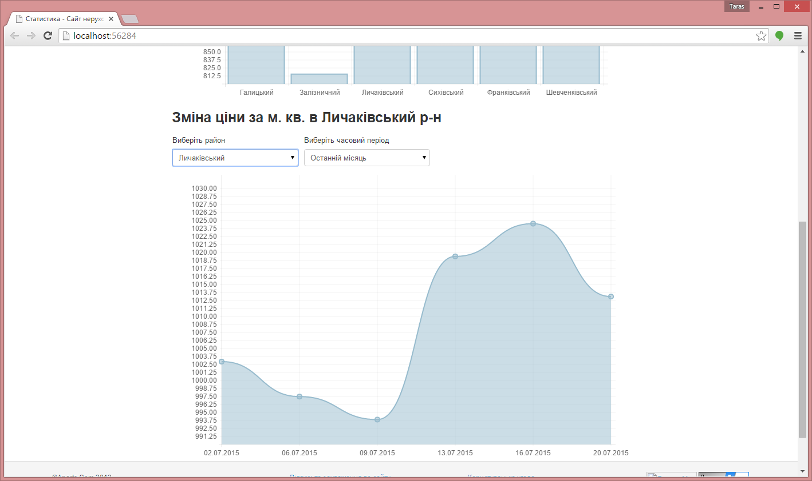
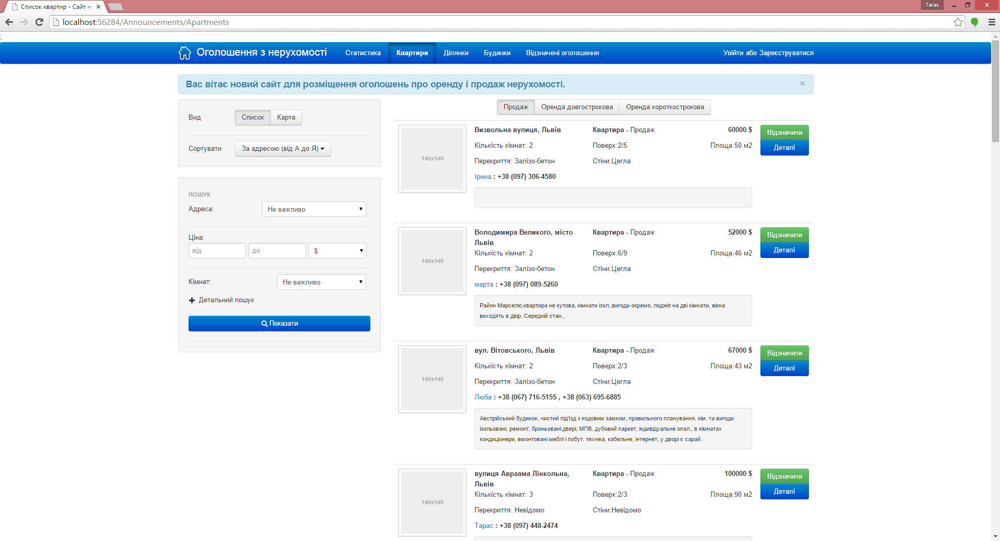

# Rielstartup

## About 
Right now it is offline, because my host provider has raised the price for hosting. 
This is web-site for people who want to buy or sell apartment, house or land in my region. 
Also it provides the information about prices per m2 in apartments in different districts of my city. It tries to parse popular website it my region and generate statistic data: prices per m2 in apartments in different districts of my city, and dynamic of this price in time. 
There is good feature: when user tries to add announcement about apartment it is enough to click on the map and address will load automatically. Also user can use apartments that are selling on the map.

## Technologies that I have used
.NET Framework 4, ASP.NET MVC 4, EntityFramework 5, HTML5, JQuery, Bootstrap, MS SQL Server 2008, Yandex maps API (The same as google maps api).

## Screenshots
 

 

 

 

 

 

## Commercial idea of this project 
Limit the number of announcements for users (realtors). 

